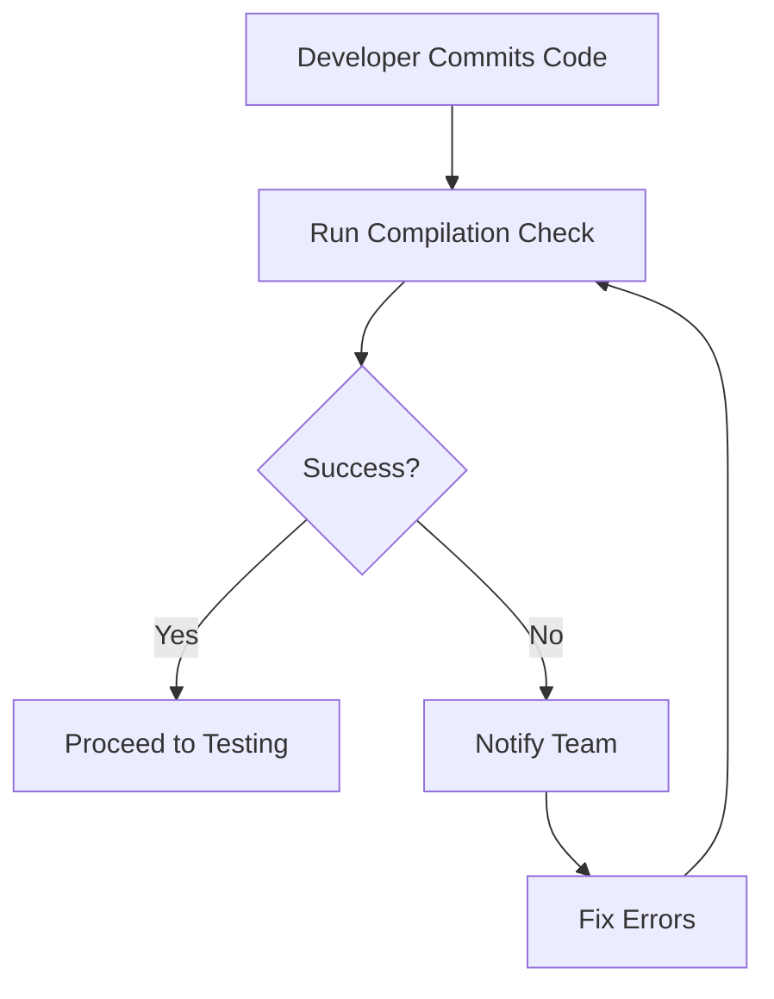

# Documentation: Python Code Compilation Checks

| Last Updated | Version | Author          | Comment         | Reviewer |
|--------------|---------|-----------------|-----------------|----------|
|  21-05-2025  | V1      | Nishkarsh Kumar | Internal Review | Pritam   |

## Table of Contents
1. [Introduction](#1-introduction)  
2. [What & Why?](#2-what--why)  
3. [Workflow Diagram](#3-workflow-diagram)  
4. [Tools Comparison](#4-tools-comparison)  
5. [Best Practices](#5-best-practices)  
6. [Conclusion & Recommendation](#6-conclusion--recommendation)  
7. [Contact](#contact)  
8. [References](#references)

## 1. Introduction
Python code compilation checks verify that scripts are syntactically correct before execution. While Python is interpreted, these checks prevent runtime failures by catching syntax errors early. This documentation covers both manual terminal checks and CI/CD integration approaches.

---

## 2. What & Why?

### What is a Python Compilation Check?
- Validates Python code can be parsed without syntax errors  
- Does not execute the code (unlike unit tests)

### Why Perform Compilation Checks?
**Early Error Detection** - Catch syntax mistakes before runtime  
**CI/CD Integration** - Automate checks in pipelines  
**Improve Code Quality** - Reduce production bugs  

---

## 3. Workflow Diagram


## 4. Tools Comparison

| Tool      | Command                         | Pros                          | Cons                      |
|-----------|----------------------------------|-------------------------------|---------------------------|
| py_compile| `python -m py_compile file.py`  | Built-in, no dependencies     | Only basic syntax check   |
| Flake8    | `flake8 file.py`                | Includes PEP8 checks          | Not pure compilation      |
| Pylint    | `pylint file.py`                | Comprehensive analysis        | Slow, overkill            |
| Mypy      | `mypy file.py`                  | Type checking                 | Requires type hints       |

---

## 5. Best Practices

- Use pre-commit hooks to catch errors early  
- Integrate into CI/CD pipelines  
- Combine tools for comprehensive checking  
- Fail fast – stop pipeline on errors  

---

## 6. Conclusion & Recommendation

After evaluating all options, we recommend using Python's built-in `py_compile` for code compilation checks because:

✔ No external dependencies required  
✔ Simple and reliable syntax validation  
✔ Fast execution compared to linters  
✔ Native Python solution with no setup  

**Implementation Example:**

```bash
# Basic check
python -m py_compile script.py

# Recursive check for a package
find . -name "*.py" -exec python -m py_compile {} +
```
## Contact

| **Name**    | **Email**                |
|-------------|--------------------------|
| Nishkarsh Kumar     | nishkarsh.kumar.snaatak@mygurukulam.co  |


## References  

| Title                          | Link                                                                 |  
|--------------------------------|----------------------------------------------------------------------|  
| Python py_compile Documentation       | [Visit](https://docs.python.org/3/library/py_compile.html) |  
| Python Packaging Guide                  | [Visit](https://packaging.python.org/en/latest/) |  
