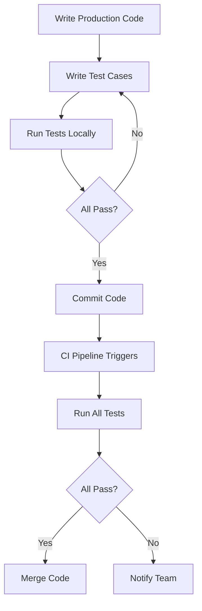

# Documentation: Go Unit Testing

| Last Updated | Version | Author          | Comment         | Reviewer |
|--------------|---------|-----------------|-----------------|----------|
|  21-05-2025  | V1      | Nishkarsh Kumar | Internal Review | Pritam   |

## Table of Contents
1. [Introduction](#introduction)
2. [What is Go Unit Testing?](#what-is-go-unit-testing)
3. [Why Implement Unit Testing in Go?](#why-implement-unit-testing-in-go)
4. [Workflow Diagram](#workflow-diagram)
5. [Tools Comparison](#tools-comparison)
6. [Advantages of Unit Testing in Go](#advantages-of-unit-testing-in-go)
7. [Best Practices](#best-practices)
8. [Recommendation & Conclusion](#recommendation--conclusion)
9. [Contact Information](#contact-information)
10. [References](#references)

## Introduction

Unit testing is a critical component of modern software development that ensures code reliability and maintainability. In Go, unit testing is a first-class citizen with built-in support through the `testing` package. This document provides a comprehensive guide to unit testing in Go, including tool comparisons and practical terminal commands.

## What is Go Unit Testing?

Go unit testing involves:
- Writing test functions alongside production code
- Testing individual units (functions, methods) in isolation
- Using the standard `testing` package or third-party frameworks
- Running tests via the `go test` command
- Measuring code coverage
- Integrating with CI/CD pipelines

## Why Implement Unit Testing in Go?

1. **Early Bug Detection**: Catch issues during development
2. **Code Quality**: Maintain high standards across the codebase
3. **Refactoring Safety**: Ensure changes don't break existing functionality
4. **Documentation**: Tests serve as executable specifications
5. **CI/CD Integration**: Enable automated quality gates
6. **Performance Tracking**: Benchmark critical paths

## Workflow Diagram

## Tools Comparison

### Framework Comparison Table

| Tool              | Assertions | Mocking | Benchmark | Coverage | BDD  | Learning Curve | `go test` Compatible |
|-------------------|------------|---------|-----------|----------|------|----------------|-----------------------|
| Standard testing  | No         | Manual  | Yes       | Yes      | No   | Low            | Yes (native)          |
| Testify           | Rich       | Yes     | Yes       | Yes      | No   | Low-Medium     | Yes                   |
| Ginkgo            | Yes        | Yes     | Yes       | Yes      | Yes  | Medium         | Partial               |
| GoConvey          | Yes        | No      | Limited   | Yes      | Yes  | Low-Medium     | Yes                   |
| GoMock            | No         | Yes     | No        | Yes      | No   | Medium         | Yes                   |

## Advantages of Unit Testing in Go

- **Fast Execution**: Go tests run quickly  
- **Simple Tooling**: Built-in `go test` command  
- **Parallel Testing**: Easy test parallelization  
- **Coverage Tools**: Built-in coverage analysis  
- **Benchmarking**: Integrated performance testing  
- **Minimal Setup**: No complex configuration needed  

---

## Best Practices
- Test Organization
- Naming Conventions
- Test Quality
- CI Integration

---

## Recommendation & Conclusion

Go's testing framework offers a fast, simple, and powerful solution for writing and running unit tests. Leveraging table-driven tests, subtests, and built-in tooling like coverage and benchmarks ensures high-quality, maintainable code. Integrating these practices into your CI/CD pipeline maximizes confidence and minimizes bugs in production.

## Contact

| **Name**    | **Email**                |
|-------------|--------------------------|
| Nishkarsh Kumar     | nishkarsh.kumar.snaatak@mygurukulam.co  |

## References  

| Title                          | Link                                                                 |  
|--------------------------------|----------------------------------------------------------------------|  
| Go Testing Package Documentation       | [Visit](https://pkg.go.dev/testing) |  
| Effective Go - Testing                  | [Visit](https://go.dev/doc/effective_go#testing) |  
