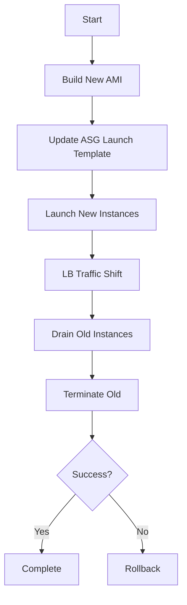

# Immutable Infrastructure Rollout (Rolling Deployment)

| Last Updated | Version | Author          | Comment         | Reviewer |
|--------------|---------|-----------------|-----------------|----------|
|  03-07-2025  | V1      | Nishkarsh Kumar | Internal Review | Pritam   |

---
## Table of Contents
- [Overview](#overview)
- [Objectives](#objectives)
- [High-Level Flow Diagram](#high-level-flow-diagram)
- [Terraform Implementation](#terraform-implementation)
  - [Key Components](#key-components)
  - [Execution](#execution-steps)
- [Rollback Strategy](#rollback-strategy)
- [Contact Information](#contact-information)
- [References](#references)

## Overview
This document outlines the design for implementing immutable infrastructure with a rolling deployment strategy to ensure zero-downtime deployments.

## Objectives
- Implement immutable infrastructure principles
- Use rolling deployment strategy
- Automate with Terraform
- Ensure rollback capabilities

## High-Level Flow Diagram

## Terraform Implementation

### Key Components
- **Auto Scaling Group (ASG)**  
  Configured with `create_before_destroy` lifecycle for zero-downtime deployments
- **Launch Template**  
  References the new immutable AMI with versioned updates
- **Load Balancer Integration**  
  ALB/NLB with target groups for gradual traffic shifting
- **CloudWatch Alarms**  
  Auto-rollback triggers based on health metrics

### Execution Steps
1. **Update Variables**  
   Modify `new_ami_id` in your Terraform variables:
   ```hcl
   variable "new_ami_id" {
     description = "ID of the new immutable AMI"
     type        = string
   } 
   ```

2. **Preview Changes**
```bash
terraform plan -var="new_ami_id=ami-1234567890abcdef0"
```

3. **Apply Deployment**
Execute changes with auto-approval (for CI/CD):

```bash
terraform apply -var="new_ami_id=ami-1234567890abcdef0" -auto-approve
```

## Rollback Strategy
**Automated**
- Triggered by failed health checks or CloudWatch alarms
- Reverts to last stable version within 5 minutes

**Manual**
- Reapply previous Terraform state
- Adjust Auto Scaling Group if needed
- Verify traffic returns to stable instances
- Typical recovery time: <15 minutes

## Contact Information  
| **Name**    | **Email**                |
|-------------|--------------------------|
| Nishkarsh Kumar     | nishkarsh.kumar.snaatak@mygurukulam.co  |  

---

## References  

| Title                          | Link                                                                 |  
|--------------------------------|----------------------------------------------------------------------|  
| Terraform ASG Official Documentation       | [Visit](https://registry.terraform.io/providers/hashicorp/aws/latest/docs/resources/autoscaling_group) |  
| AWS Immutable Infrastructure Whitepaper                  | [Visit](https://docs.aws.amazon.com/whitepapers/latest/introduction-devops-aws/introduction-to-devops.html) |  
