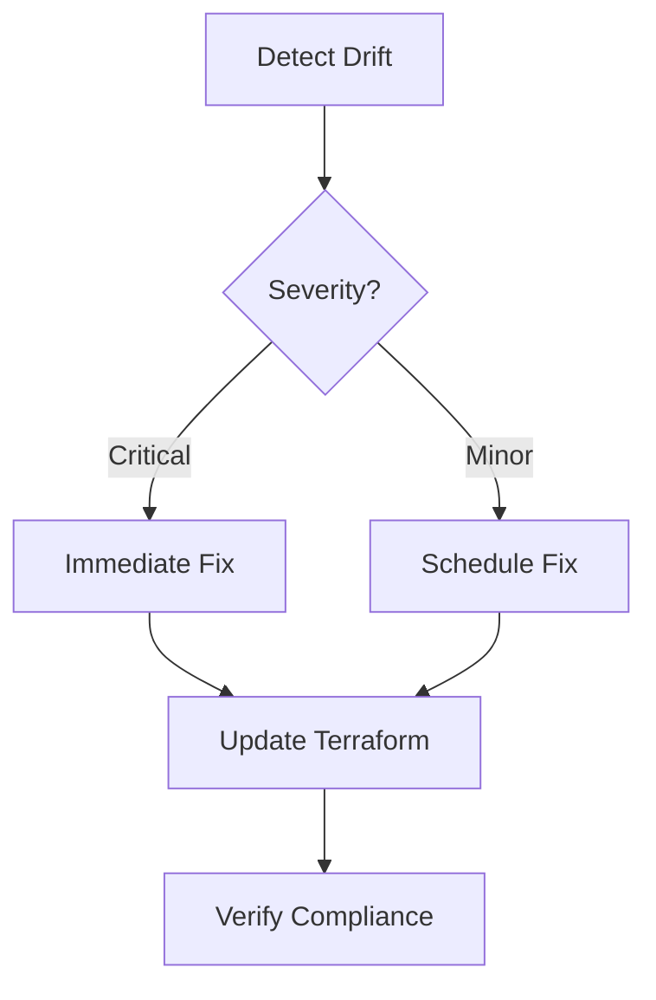

# Infrastructure GitOps (Beyond Expectation) - Terraform Infra Divergence Management

| Last Updated | Version | Author          | Comment         | Reviewer |
|--------------|---------|-----------------|-----------------|----------|
|  06-07-2025  | V1      | Nishkarsh Kumar | Internal Review | Pritam   |

## Table of Contents
- [Introduction](#introduction)
- [Understanding Terraform Infra Divergence](#understanding-terraform-infra-divergence)
- [Causes of Infrastructure Divergence](#causes-of-infrastructure-divergence)
- [Detection Methods](#detection-methods)
- [Management Strategies](#management-strategies)
  - [Prevention Strategies](#prevention-strategies)
  - [Correction Strategies](#correction-strategies)
- [Best Practices](#best-practices)
- [Conclusion](#conclusion)
- [Contact Information](#contact-information)
- [References](#references)

---

## Introduction

In a GitOps workflow, infrastructure is managed through declarative configuration stored in version control. Terraform is a key tool in this approach, enabling infrastructure as code (IaC). However, a common challenge is "infrastructure divergence" - when the actual state of cloud resources differs from what's defined in your Terraform configuration.

This document explains Terraform infrastructure divergence concepts, their causes, detection methods, and management strategies to maintain consistency in your GitOps workflows.

---

## Understanding Terraform Infra Divergence

Infrastructure divergence occurs when there's a mismatch between:

1. The desired state (what's defined in your Terraform code)
2. The actual state (what exists in your cloud environment)
3. The Terraform state file (`terraform.tfstate`)

**Types of divergence**:

| Type | Description |
|------|-------------|
| Configuration Drift | Manual changes made directly to cloud resources |
| State Drift | Terraform state file becomes out of sync with actual resources |
| Version Drift | Different versions of Terraform or providers create inconsistencies |

---

## Causes of Infrastructure Divergence

1. **Manual changes**: Direct modifications to cloud resources bypassing Terraform
2. **Parallel operations**: Multiple team members applying changes simultaneously
3. **State file issues**:
   - Mismanagement
   - Corruption
   - Improper sharing
4. **Provider limitations**: Cloud provider APIs may not fully support all resource properties
5. **External processes**: Automated systems or third-party tools modifying resources
6. **Partial applies**: Failed or interrupted Terraform operations

---

## Detection Methods

### 1. Terraform Commands
```bash
# Detect differences between code and state
terraform plan -detailed-exitcode

# Update state with real-world resources
terraform refresh
```
### 2. Drift Detection Tools
```bash
# Using driftctl
driftctl scan --tfstate terraform.tfstate
```
### 3. CI/CD Pipeline Integration
```bash
# Example GitHub Actions workflow
- name: Terraform Plan
  id: plan
  run: |
    terraform init
    terraform plan -no-color -input=false -out=tfplan
```
### 4. Monitoring Solutions
- Cloud provider native tools (AWS Config, Azure Policy)
- Custom alerts based on CloudTrail logs
- Scheduled drift detection jobs

## Management Strategies

### Prevention Strategies

| Strategy           | Implementation                          | Tools                          |
|--------------------|----------------------------------------|--------------------------------|
| **Access Control** | IAM policies, temporary credentials    | AWS IAM, Azure RBAC            |
| **GitOps Enforcement** | PR requirements, CODEOWNERS        | GitHub, GitLab                 |
| **State Management** | Remote backends with locking       | Terraform Cloud, S3+DynamoDB   |

## Correction Strategies

### 1. Resource Import
```bash
terraform import aws_instance.example i-1234567890abcdef0
```
### 2. State Manipulation
```bash
# Remove resource from state
terraform state rm aws_instance.old

# Rename resource in state
terraform state mv aws_instance.old aws_instance.new
```

### 3. Reconciliation Workflow

## Best Practices

### 🛡️ Immutable Infrastructure
- **"Replace rather than modify" approach**
- Leverage Terraform's lifecycle management:
  ```hcl
  lifecycle {
    create_before_destroy = true
  }
```

### State Hygiene
```bash
# List all resources in state
terraform state list

# Inspect specific resource
terraform state show aws_instance.example

# Regularly validate state
terraform validate
```
## Environment Strategy

- Separate state files per environment
- Use Terraform workspaces

## Change Control

- Peer reviews for all Terraform changes
- Automated plan validation in CI/CD

## Monitoring

- Track divergence metrics over time
- Alert on manual changes

## Conclusion

Key takeaways for managing Terraform infrastructure divergence:

- Prevention is more effective than correction
- Automation reduces human error
- Visibility through monitoring is critical
- Culture of infrastructure-as-code adoption is fundamental

## Contact Information  
| **Name**    | **Email**                |
|-------------|--------------------------|
| Nishkarsh Kumar     | nishkarsh.kumar.snaatak@mygurukulam.co  |  

---

## References  

| Title                          | Link                                                                 |  
|--------------------------------|----------------------------------------------------------------------|  
| Splunk Documentation       | [Visit](https://docs.splunk.com/) |  
| Grafana Loki Docs                  | [Visit](https://grafana.com/docs/loki/latest/) |
