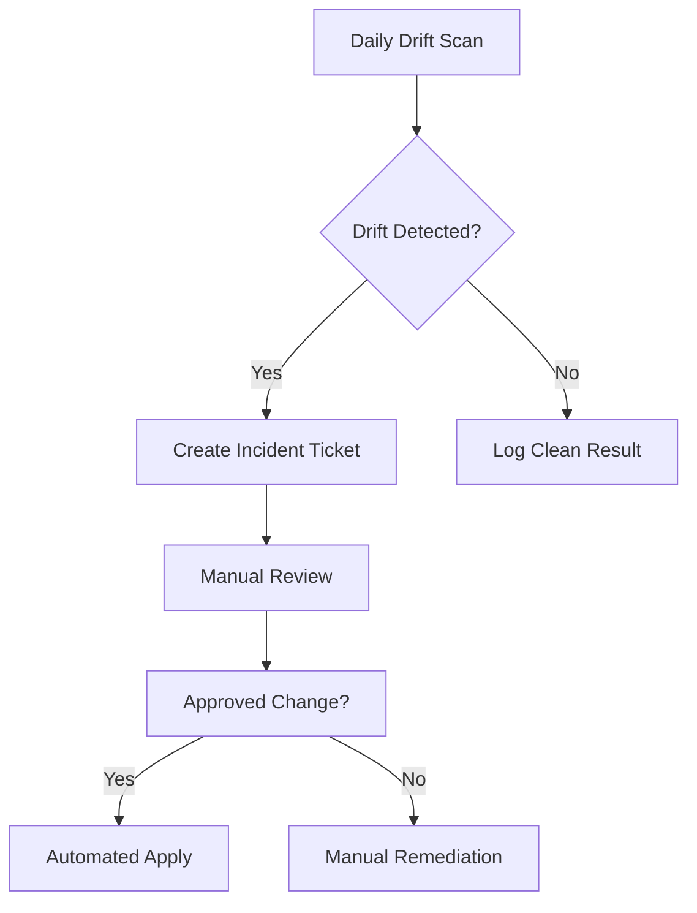

# Terraform Infrastructure Divergence Management POC

| Last Updated | Version | Author          | Comment         | Reviewer |
|--------------|---------|-----------------|-----------------|----------|
|  09-07-2025  | V1      | Nishkarsh Kumar | Internal Review | Pritam   |

## Table of Contents
- [Overview](#overview)
- [Prerequisites](#prerequisites)
- [POC Implementation](#poc-implementation)
  - [Drift Detection Setup](#1-drift-detection-setup)
  - [Automated Drift Management](#2-automated-drift-management)
  - [CI/CD Integration Example](#3-cicd-integration-example)
- [Demonstration Scenarios](#demonstration-scenarios)
  - [Scenario 1: Manual Change Detection](#scenario-1-manual-change-detection)
  - [Scenario 2: State Reconciliation](#scenario-2-state-reconciliation)
- [Output Samples](#output-samples)
- [Management Workflow](#management-workflow)
- [Verification](#verification)
- [Contact Information](#contact-information)
- [References](#references)


## Overview
This proof of concept demonstrates detection and management of infrastructure drift in a GitOps workflow using Terraform. The POC showcases methods to identify, prevent, and correct divergence between declared and actual infrastructure states.

## Prerequisites
- Terraform v1.5+
- AWS/Azure/GCP account (configured provider)
- Git client
- jq (for JSON output processing)

## POC Implementation

### 1. Drift Detection Setup
```bash
# Initialize Terraform
terraform init

# Perform drift detection
terraform plan -detailed-exitcode -out=tfplan
```

# Expected Terraform Output
```text
Changes to Outputs:
  ~ instance_id = "i-abc123" -> (known after apply)

Plan: 1 to add, 0 to change, 1 to destroy.
```

## 2. Automated Drift Management

```bash
# Apply corrective actions
terraform apply tfplan

# Verify correction
terraform refresh
terraform plan
```

## 3. CI/CD Integration Example

.github/workflows/terraform-drift.yml:

```yaml
name: Terraform Drift Detection
on:
  schedule:
    - cron: '0 12 * * *' # Daily check

jobs:
  drift-check:
    steps:
      - uses: hashicorp/setup-terraform@v2
      - run: terraform plan -no-color -input=false
        continue-on-error: true
      - uses: actions/github-script@v6
        if: failure()
        with:
          script: |
            github.issues.createComment({
              issue_number: context.issue.number,
              body: 'Infrastructure drift detected!'
            })
```

## Demonstration Scenarios

### Scenario 1: Manual Change Detection

1. Manually modify an EC2 instance tag in the AWS Console.
2. Run the following command:
```bash
   terraform plan
```
3. Observe the drift detection output showing the difference between the desired and actual state.

### Scenario 2: State Reconciliation

```bash
# Import manually created resource
terraform import aws_s3_bucket.example bucket-name

# Correct state mismatch
terraform state rm aws_instance.legacy
```

### Output Samples

Drift Detection Output:

```text
Note: Objects have changed outside of Terraform

Terraform detected the following changes made outside of its control:
  # aws_instance.web has been changed
  ~ resource "aws_instance" "web" {
        id       = "i-abc123"
      + tags     = {
          + "env" = "prod"
        }
    }
```

### 2. Correction Output

```text
Apply complete! Resources: 1 added, 0 changed, 1 destroyed.
State successfully reconciled with infrastructure.
```

## Management Workflow

### Diagram



### Verification

Run validation script:

```bash
./validate_drift_management.sh
```
### Check Outputs

- Terraform state matches cloud provider  
- All resources tagged with managed_by = "terraform"  
- No unapproved changes in last 30 days

## Contact Information  
| **Name**    | **Email**                |
|-------------|--------------------------|
| Nishkarsh Kumar     | nishkarsh.kumar.snaatak@mygurukulam.co  |  

---

## References  

| Title                          | Link                                                                 |  
|--------------------------------|----------------------------------------------------------------------|  
| Terraform Official Documentation - Drift Detection       | [Visit](https://developer.hashicorp.com/terraform/tutorials/state/resource-drift) |  
| GitOps Working Group - Best Practices                  | [Visit](https://www.gitops.tech/) |
