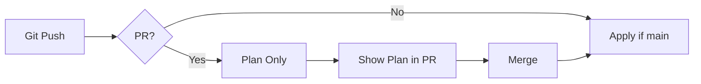

# Terraform GitOps Minimal POC

| Last Updated | Version | Author          | Comment         | Reviewer |
|--------------|---------|-----------------|-----------------|----------|
|  10-07-2025  | V1      | Nishkarsh Kumar | Internal Review | Pritam   |

## Table of Contents
1. [Overview](#overview)
2. [Prerequisites](#prerequisites)
3. [Setup Steps](#setup-steps)
4. [Testing the Workflow](#testing-the-workflow)
5. [How It Works](#how-it-works)
6. [Cleanup](#cleanup)
7. [Contact Information](#contact-information)
8. [References](#references)

## Overview
This POC demonstrates the simplest GitOps workflow with:
- GitHub as the single source of truth
- Terraform CLI for infrastructure
- GitHub Actions for automation
- AWS S3 for remote state storage

## Prerequisites
- GitHub account
- AWS account (free tier)
- Terraform installed locally (optional)

## Setup Steps

### 1. Create GitHub Repository
```bash
git clone https://github.com/new/terraform-gitops-minimal
cd terraform-gitops-minimal
```

### 2. Add Terraform Files
Create these files in your repo:
main.tf:
```bash
provider "aws" {
  region = "us-east-1"
}

resource "aws_vpc" "main" {
  cidr_block = "10.0.0.0/16"
  tags = {
    Name = "GitOps-POC-VPC"
  }
}
```

backend.tf:
```bash
terraform {
  backend "s3" {
    bucket = "your-unique-bucket-name"
    key    = "terraform.tfstate"
    region = "us-east-1"
  }
}
```

### 3. Configure GitHub Actions
Create .github/workflows/terraform.yml:

```yaml
name: Terraform GitOps
on:
  push:
    branches: [main]
  pull_request:

jobs:
  terraform:
    runs-on: ubuntu-latest
    permissions:
      contents: read
      id-token: write
      
    steps:
      - uses: actions/checkout@v4
      
      - uses: hashicorp/setup-terraform@v2
      
      - name: Terraform Init
        run: terraform init
        
      - name: Terraform Plan
        if: github.event_name == 'pull_request'
        run: terraform plan -no-color
        
      - name: Terraform Apply
        if: github.ref == 'refs/heads/main'
        run: terraform apply -auto-approve
```

## 4. Configure AWS Credentials

In your GitHub repository:

1. Go to:  
   Settings → Secrets → Actions

2. Add the following secrets:

- AWS_ACCESS_KEY_ID  
- AWS_SECRET_ACCESS_KEY

## Testing the Workflow

Make a change:

```bash
git checkout -b add-tags

echo 'resource "aws_subnet" "test" { 
  vpc_id     = aws_vpc.main.id
  cidr_block = "10.0.1.0/24"
}' >> main.tf

git add . && git commit -m "Add test subnet"
git push origin add-tags
```

Create and Merge Pull Request

- Create a Pull Request
- GitHub will automatically run terraform plan
- Review the output in PR checks
- Merge the PR
- GitHub will automatically run terraform apply

## How It Works



## Cleanup

To destroy resources:

```bash
terraform destroy
```

## Contact Information  
| **Name**    | **Email**                |
|-------------|--------------------------|
| Nishkarsh Kumar     | nishkarsh.kumar.snaatak@mygurukulam.co  |  

---

## References  

| Title                          | Link                                                                 |  
|--------------------------------|----------------------------------------------------------------------|  
| Terraform Documentation       | [Visit](https://developer.hashicorp.com/terraform/docs) |  
| AWS S3 Backend                  | [Visit](https://developer.hashicorp.com/terraform/language/backend/s3) |
